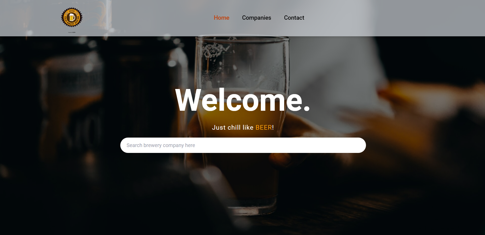
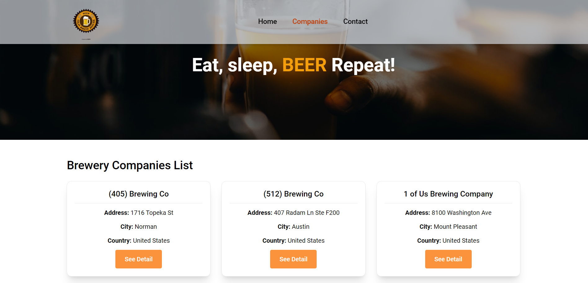
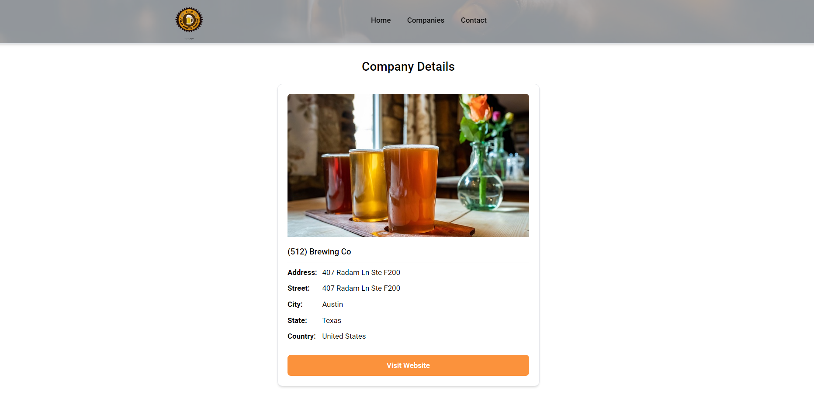
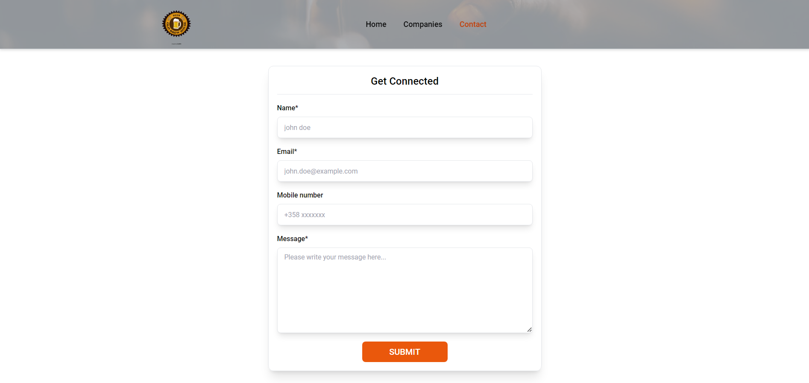

# Breweries App

The Breweries App is a web application developed using React and TypeScript. It allows users to browse list of breweries fetched from the Open Brewery DB API.

## Application Images

## Technologies Used

- **TypeScript**
- **React**
- **React Router**
- **Tailwind CSS**
- **React Hook Form**

## Features

1. Browse a comprehensive list of breweries powered by the Open Brewery DB API.
2. View basic information about each brewery such as name, city, state, street address, and country.
3. View detail information of each brewery on separte page on click of any brewery.
4. User-friendly interface designed for smooth navigation and seamless browsing.

## Deploy

The application is deployed using vercel. Click here to check the application [Demo](https://brewerycompany.vercel.app/)
